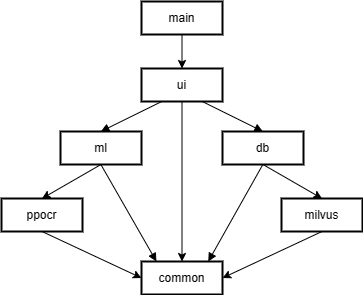

# milvus-frontend

## 运行前准备

1. [安装rye](https://rye-up.com/guide/installation/)
2. 运行milvus
3. 控制台输入 `rye sync`
4. 下载[PaddleOCR-json程序](https://github.com/hiroi-sora/PaddleOCR-json/releases/tag/v1.3.0)并解压到当前目录
5. 从 https://www.sbert.net/docs/pretrained_models.html 下载合适的机器学习模型（项目默认使用的模型为 https://huggingface.co/sentence-transformers/distiluse-base-multilingual-cased-v2 ）（**需要代理上网**），把模型文件夹粘贴到./model文件夹内，然后修改src/common/config.py中MilvusSettings的`MODEL_NAME_OR_PATH`属性为模型文件夹路径

## 运行
`rye run main`

## 打包

1. 运行 `rye run pack`（很可能需要代理上网）（预计时间3个小时左右）
2. 将之前下载的机器学习模型文件夹粘贴到out\main.dist\model文件夹内
3. 将之前的PaddleOCR-json程序粘贴到 out\main.dist 文件夹内

---

## 项目架构

- `main` 入口文件main.py
- `ui` ui层，提供gui界面，处理用户输入
- `ml` 机器学习相关模块，负责将导入的病历解析为数据库表中数据
- `db` milvus模块的业务封装，负责表的定义、分表、提供增删改查接口工作。
- `ppocr` 负责图片转文字(ocr)功能
- `milvus` `pymilvus`库的封装，负责简化milvus数据库的连接和增删改查、自动生成向量字段等功能
- `common` 包含全局设置、数据格式的定义
  
各模块通过[injector模块](https://github.com/python-injector/injector)进行依赖注入

## Python版本、包管理工具

使用[rye](https://rye-up.com/guide/)作为开发工具，可以通过rye管理Python版本、Python包依赖、打包发行等等功能，以下是rye的几个常用命令示例：
- `rye pin 3.10` 修改项目的Python为3.10
- `rye add numpy` 增加numpy包依赖（此时项目中还没有下载numpy，只是添加到了依赖项列表里）
- `rye remove numpy` 删除numpy包依赖（同上）
- `rye sync` 下载所需的Python版本和所有依赖项，只有经过这一步以后项目才能正常运行
- `rye run main` 运行事先设置好的`main`命令，在pyproject.toml里的[tool.rye.scripts]栏目下可以看到全部的脚本命令  
关于更详细的使用说明，请参看rye文档